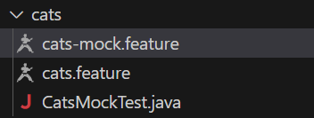

# KarateモックをJavaベースのAPIテストスイートに組み込む

## はじめに

こんにちは、開発エンジニア兼テスト自動化アーキテクトの髙橋です。

以前、弊社メンバーよりAPIテスト自動化ツールのKarateについて紹介させていただきました。
[APIテスト自動化ツール「Karate」現場ですぐに使える実装パターン8選(前編)](https://note.shiftinc.jp/n/n614cedcbe9d7)


この中で、KarateはAPIクライアントとしてだけでなくモックとしても使えるとお話しさせていただきました。
イメージとしては以下のようになります。


近年はマイクロサービス化によって複数のサーバ/コンテナあるいはサーバレスプラットフォームで構成されたアーキテクチャが多くなってきており、APIテストにおいてこのようなモックツールの重要性が増しております。

## モックツールをJavaベースのAPIテストスイートに組み込む際の問題点

しかしモックツールをKarateやREST-AssuredなどのJavaベースの自動テストスイートに組み込むには２点ほど問題点があります。

1. サーバの起動に個別の設定やコマンドラインの準備が必要
2. シナリオ/ダミーデータファイルとテストケースの紐づけ管理が面倒

それぞれ細かく見ていきます。

1. サーバの起動に個別の設定やコマンドラインの準備が必要
大体のモックツールはサーバの起動に個別の設定やコマンドラインの準備が必要で、テストスイートに組み込む際は自動テスト実行前にあらかじめ起動しておいて一連のテストが終わった後に手動で停止させる必要があります。
あるいは自動でやる場合はプログラムから呼び出す為にコマンドラインを構築したり、必要な設定を書き換えたり場合によってはシナリオやダミーデータを差し替えたりする処理も用意しなければならず面倒です。

2. シナリオファイルとテストケースの紐づけ管理が面倒
モックのシナリオやダミーデータはテストケースと紐づくため、可能な限り一緒に管理すべきですが、仮に同じリポジトリで管理していても実際のテスト実行時は別々の場所に分けて配置して実行しなければならない事が多く、管理と運用のトレードオフに悩まされる場合が多々あります。

しかし、Karateならばこれらの問題を解決できます。

## KarateモックサーバはJava APIで設定/起動できる

そのカギとなるのが、KarateのモックサーバをJava APIで操作できる機能です。

KarateテストはJUnit上で動かしますが、例えば以下のようにbeforeとafterでモックサーバを起動/停止できればどうでしょう？
必要な時だけ起動し、テストが終わったら自動で止めることが出来る上に、テストケースとモックサーバ操作の紐づけがシンプルで分かりやすいですよね。

```java
class XXXXXTest {
    @BeforeAll
    static void beforeAll() {
        // ここでモックサーバ起動
    }

    ～APIテストケース～

    @AfterAll
    static void afterAll() {
        // ここでモックサーバ終了
    }
}
```

KarateであればJava APIでモックサーバを操作できるため、このような実装が容易です。
また、以下の通りシナリオやダミーデータファイルもテストケースと同じプロジェクトに含めることが出来るため紐づけ管理も容易になります。

```java
src/test/java/examples
├─ testA
│  ├─ requestData
│  │  └─ AAA.yaml  // リクエストテストデータ
│  ├─ responseData
│  │  └─ BBB.yaml  // ダミーレスポンスデータ
│  ├─ testA.feature  // APIテストシナリオ
│  ├─ testA-mock.feature  // APIモックシナリオ
│  └─ XXXXXTest.java  // テスト実行ファイル
├─ testB
:
```

## 実際に試してみる

### 環境構築

事前に、お試しの環境について記載しておきます。

OS ：Amazon Linux release 2 (Karoo)
JDK：openjdk 21.0.4 2024-07-16 LTS


では実際にやってみます。
まず、ベースとなるKarateのアーキタイプを取得します。

```bash
$ mvn archetype:generate \
-DarchetypeGroupId=com.intuit.karate \
-DarchetypeArtifactId=karate-archetype \
-DarchetypeVersion=1.4.1 \
-DgroupId=example -DartifactId=karate-mock-sample

：
Define value for property 'version' 1.0-SNAPSHOT: : ★そのままEnter
：
 Y: : Y ★Yを入力
：
 [INFO] BUILD SUCCESS ★SUCCESSを確認
```

念のため動作確認してSUCCESSになることを確認しておきます

```
$ mvn test
[INFO] ------------------------------------------------------------------------
[INFO] BUILD SUCCESS
[INFO] ------------------------------------------------------------------------
[INFO] Total time:  13.537 s
[INFO] Finished at: 2025-03-11T16:01:16Z
[INFO] ------------------------------------------------------------------------
```
※アーキタイプは中でテスト用のRESTサービスにリクエストしてるので、
　テスト失敗する場合はそこと通信できていない場合がほとんどです。
　今回試すのは外部への通信は発生しないため、失敗原因がそれであれば無視して構いません。

次に、KarateLabのGitHubにJava APIを使ったマイクロサービスのデモがあるので
リポジトリを上記とは別のディレクトリにクローンします。

```bash
$  git clone https://github.com/karatelabs/karate.git
```

karate/karate-demo/src/test/java/mock/microがそれです。

```bash
$ cd karate/karate-demo/src/test/java/mock/micro/
$ ls
cats.feature  cats-mock.feature  CatsMockRunner.java
```

これで必要な準備は整いました。

### モック作成

作成と言っても上記のデモをアーキタイプに移植するだけです。
まず既存のシナリオとテストコードは邪魔なので消してしまいます。
動作確認までしたけどショウガナイネ

```bash
以下を削除
examples/users
examples/ExamplesTest.java
```

次にマイクロサービスのデモをexamples配下にコピーしてリネーム

```bash
以下のようにコピー＆リネーム
mock/micro -> examples/cats
mock/micro/CatsMockRunner.java -> examples/cats/CatsMockTest.java
```

CatsMockTest.javaの中身を以下のように修正します

```java
package mock.micro;

import com.intuit.karate.Results;
import com.intuit.karate.Runner;
import com.intuit.karate.core.MockServer;
import org.junit.jupiter.api.BeforeAll;
import org.junit.jupiter.api.Test;
import static org.junit.jupiter.api.Assertions.*;

import org.junit.jupiter.api.AfterAll;
/**
 *
 * @author pthomas3
 */
class CatsMockTest { // ★Runner->Testにリネームして直接JUnitのテスト対象にする

    static MockServer server;

    @BeforeAll
    static void beforeAll() {
        server = MockServer
                .feature("classpath:examples/cats/cats-mock.feature") // ★パスを移植後に合わせる
                .arg("demoServerPort", null)
                .http(0).build();
    }

    @Test
    void testMock() {
        Results results = Runner.path("classpath:examples/cats/cats.feature") // ★パスを移植後に合わせる
                .karateEnv("mock")
                .systemProperty("mock.cats.url", "http://localhost:" + server.getPort() + "/cats")
                .parallel(1);
        assertTrue( results.getFailCount() == 0, results.getErrorMessages());
    }

    @AfterAll
    static void afterAll() {
        server.stop(); // ★afterAllとサーバ停止の後始末を追加
    }
}
```

この状態でmvn test実施してみましょう。
何やら色々と動いて通りますね。

```bash
$ mvn test
[INFO] -------------------------------------------------------
[INFO]  T E S T S
[INFO] -------------------------------------------------------
[INFO] Running mock.micro.CatsMockTest
：
17:19:38.269 [armeria-boss-http-*:45847] INFO  com.linecorp.armeria.server.Server - Serving HTTP at /[0:0:0:0:0:0:0:0%0]:45847 - http://127.0.0.1:45847/
：
17:19:39.035 [main] DEBUG com.intuit.karate - request:
1 > POST http://localhost:45847/cats
：
[INFO] ------------------------------------------------------------------------
[INFO] BUILD SUCCESS
[INFO] ------------------------------------------------------------------------
[INFO] Total time:  13.446 s
[INFO] Finished at: 2025-03-11T17:19:41Z
[INFO] ------------------------------------------------------------------------
```

ここで移植したマイクロサービスの中身を解説します。

- CatsMockTest.java
これは移植時に中身を修正している際になんとなくお判りいただけたと思いますが
beforeとafterでモックサーバの起動停止を行い、テストコード本体でKarateのAPIリクエストのテストシナリオを実施しています。


```java
class CatsMockTest {

    static MockServer server;

    @BeforeAll
    static void beforeAll() {
        server = MockServer
                .feature("classpath:examples/cats/cats-mock.feature")  // ★モックシナリオを指定してモックサーバ起動
                .arg("demoServerPort", null)
                .http(0).build();  // ★ポート0を指定すると使用可能なポート番号をランダムに使用
    }

    @Test
    void testMock() {
        Results results = Runner.path("classpath:examples/cats/cats.feature")  // ★APIテストシナリオ実行（宛先はモックサーバ）
                .karateEnv("mock")
                .systemProperty("mock.cats.url", "http://localhost:" + server.getPort() + "/cats")
                .parallel(1);
        assertTrue( results.getFailCount() == 0, results.getErrorMessages()); // ★実行結果の確認
    }

    @AfterAll
    static void afterAll() {
        server.stop(); // ★モックサーバ停止
    }
}
```

- cats.feature
POSTでのデータ登録と登録データのGETを行うAPIテストシナリオです。

```java
Feature: cats integration test

Background:
    * url karate.properties['mock.cats.url']  // ★テストメソッドで指定した送信先URL取得

Scenario: create cat
    Given request { name: 'Billie' }  // ★POSTデータ登録１件目
    When method post
    Then status 200    
    And match response == { id: 1, name: 'Billie' }

    Given path 1  // ★GETパターン１：ID直接指定１件目
    When method get
    Then status 200
    And match response == { id: 1, name: 'Billie' }

    When method get  // ★GETパターン２：全件取得１回目
    Then status 200
    And match response == [{ id: 1, name: 'Billie' }]

    Given request { name: 'Bob' }  // ★POSTデータ登録２件目
    When method post
    Then status 200    
    And match response == { id: 2, name: 'Bob' }

    Given path 2  // ★GETパターン３：ID直接指定２件目
    When method get
    Then status 200
    And match response == { id: 2, name: 'Bob' }

    When method get  // ★GETパターン４：全件取得２回目
    Then status 200
    And match response == [{ id: 1, name: 'Billie' },{ id: 2, name: 'Bob' }]
```

- cats-mock.feature
POSTで登録したデータの保存とGETでの応答を行います。
※ちなみに、地味ですがこんな感じでデータを普通の言語ライクに保持して別の信号応答に使えるような
　APIモックサーバはあまり見かけないのでその意味でもKarateは使いやすくておススメです。

```java
Feature:

Background:
* def id = 0
* def m = {} // ★ 応答データの入れ物を作成

Scenario: methodIs('post') // ★ POST受信時にGET応答データを作成して保持
* def c = request
* def id = ~~(id + 1)
* c.id = id
* m[id + ''] = c
* def response = c

Scenario: pathMatches('/cats/{id}') // ★ ID指定時に該当IDのデータを応答
* def response = m[pathParams.id]

Scenario: // ★ 全件取得時にデータを全件応答
* def response = $m.*
```


上記のモック動作を簡単に図で表すと以下の通りです。


KarateとKarate同士でバトってますね。
ファイル構成もこのような感じでテストシナリオとモックシナリオが同居してかなりスッキリします。



これでも今回の目的である「KarateモックをJavaベースのAPIテストスイートに組み込む」は
ほぼ達成できているのですが、せっかくなのでこんな感じのより実際に近い構成にしてみましょう。


### APIサーバ作成

簡単にするためにリクエストを中継するだけのAPIサーバを作ってみます。
実はこのような中継サーバもKarateで作ることができます。
シナリオとしては以下のような感じになります。

- animals-server.feature

```java
Feature:

Background:
* def catsUrl = "http://localhost:33611" // ★ URLを指定（モック側のポート番号は固定しておく）

Scenario: methodIs('post') // ★ POST信号を中継
* karate.proceed(catsUrl)

Scenario: pathMatches('/cats/{id}') // ★ GET信号を中継（別の中継方法）
* def proceedResponse = karate.http(catsUrl + "/cats/" + pathParams.id).get()
* def response = proceedResponse.body

Scenario: // ★ その他信号は全て中継
* karate.proceed(catsUrl)
```

滅茶苦茶シンプルですね。
`karate.proceed`を書いておくだけで中継信号とレスポンスの転送全部やってくれます。
単純に中継したいだけならこれだけでいいです。

あるいは信号の中身を変えたりしたいのであれば`karate.http`が使用できます。
これはこれでシンプルで、中継するだけなら最小２行で済むのでかなり使いやすいですね。

簡単なお試しサーバとかの用途であれば他の同じような簡易APIサーバと全然引けを取らないと思います。

あとはこのシナリオをKarateのスタンドアロン実行JARで引数指定してあげるだけでサーバ起動できちゃいます。
動作確認の前にクライアント側の送信先ポートと、モック側の受信ポート番号だけ固定しておきましょう。
（APIサーバのポート番号は8089、モックサーバのポート番号は33611としておきます）

- CatsMockTest.java

```java
：
    @BeforeAll
    static void beforeAll() {
        server = MockServer
                .feature("classpath:examples/cats/cats-mock.feature")
                .http(33611).build(); // ★ APIサーバからの受信用ポート番号を設定
    }

    @Test
    void testMock() {
        Results results = Runner.path("classpath:examples/cats/cats.feature")
                .karateEnv("mock")
                .systemProperty("mock.cats.url", "http://localhost:8089/cats") // ★ APIサーバへの送信用URLを設定
                .parallel(1);
        assertTrue( results.getFailCount() == 0, results.getErrorMessages());
    }
：
```


### 動作確認

Karate.jarをKarateのGithubからダウンロードします。

```bash
$ wget https://github.com/karatelabs/karate/releases/download/v1.5.1/karate-1.5.1.jar
$ mv karate-1.5.1.jar karate.jar
```

次にanimals-server.featureがおいてある場所に移動してサーバを起動しましょう。
※直下にサーバログ（target/karate.log）が出力されます

```bash
$ java -jar karate.jar -p 8089 -m animals-server.feature

09:02:07.034 [main]  INFO  com.intuit.karate - Karate version: 1.5.1
09:02:09.715 [main]  INFO  com.intuit.karate - mock server initialized: animals-server.feature
09:02:09.902 [main]  DEBUG com.intuit.karate.http.HttpServer - server started: xxxxx:8089
```

この状態でcatsのmvn testを実施します。

```bash
$ mvn test
：
16:01:11.327 [main] DEBUG com.intuit.karate - request:
1 > POST http://localhost:8089/cats
：
16:01:12.875 [main] DEBUG com.intuit.karate - response time in milliseconds: 1544
1 < 200
：
[INFO] Tests run: 1, Failures: 0, Errors: 0, Skipped: 0
[INFO] 
[INFO] ------------------------------------------------------------------------
[INFO] BUILD SUCCESS
[INFO] ------------------------------------------------------------------------
[INFO] Total time:  13.537 s
[INFO] Finished at: 2025-03-11T16:01:16Z
[INFO] ------------------------------------------------------------------------
```

無事テストが通りました。
サーバログを見てもしっかり中継出来ているようです。

- サーバログ（target/karate.log）

```bash
16:01:11.906 [armeria-common-worker-epoll-3-1]  DEBUG com.intuit.karate - scenario matched at line 6: methodIs('post')
16:01:12.197 [armeria-common-worker-epoll-3-1]  DEBUG com.intuit.karate - request:
1 > POST http://localhost:33611/cats
：
16:01:12.852 [armeria-common-worker-epoll-3-1]  DEBUG com.intuit.karate - response time in milliseconds: 652
1 < 200
：
```


## APIテストスイートとして更に発展させる

これでAPIモックをテストスイートに無理なく組み込むことができるようになりました。
しかしAPIテストとして大事な要素がまだ抜けているように思えます。

そう、DBです。

実際にバックエンドサーバへのAPIテストを行うにはまずテストデータをDBに仕込んで、API実行後にDBの内容がどう変わったのかも観点として確認しなければならないでしょう。
AWS Lambdaに実装するようなマイクロサービスでDBを参照しないようなものに対するテストであれば現状でも問題ありませんが、大体の世の中のシステムはDBが必要不可欠なはずです。

しかし、そのために一々テストスイートへORMやDTOを取り込むのは気が滅入りますね…。

安心してください。もちろん解決方法はあります。

それについては…次回解説します！是非いいねかお気に入り登録をしてお待ちください！

というのは冗談ですが、次回は
「KarateのテストスイートへDBテストツールを組み込む方法」
についてお話したいと思います。乞うご期待。

